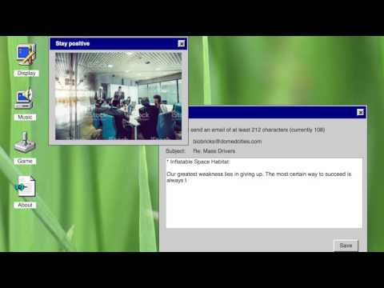

# Starting research

Today we started to learn how to use markdown as a note-taking method.

## Methodology
The originator of our method was [Pippin Barr](https://pippinbarr.com/) who found a unique method of documenting the entire design process of his brilliant game, [It Is As If You Were Doing Work](https://pippinbarr.com/itisasifyouweredoingwork/), using tools normally dedicated to computer engineering. Instead of publishing his creation process in the form of a blog, he instead published it on [github](https://github.com) using nothing more than [Markdown](https://en.wikipedia.org/wiki/Markdown), folders, images, and code.

