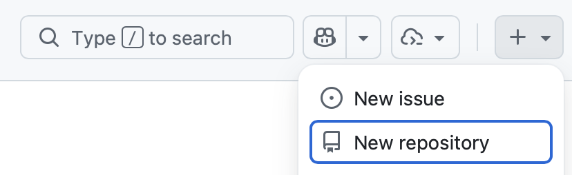
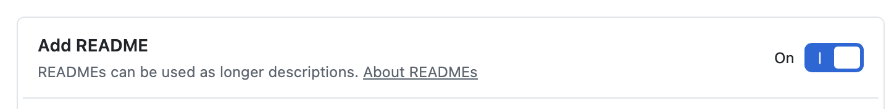
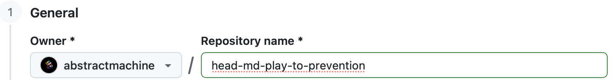
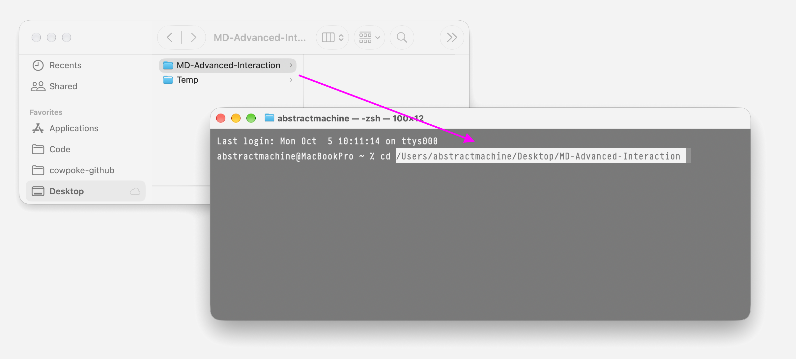
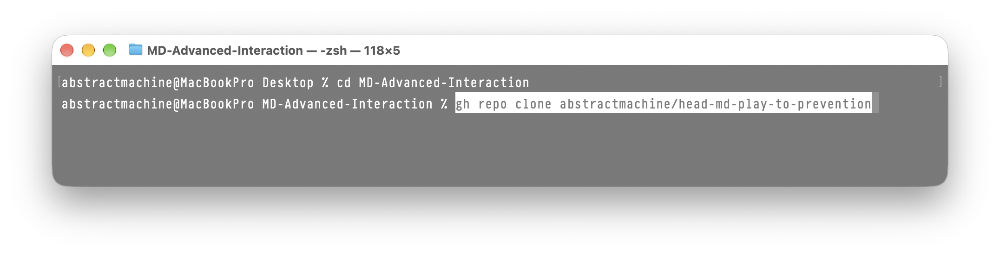
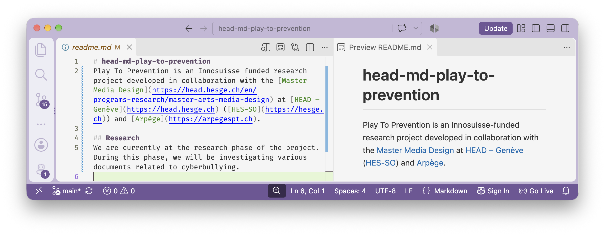
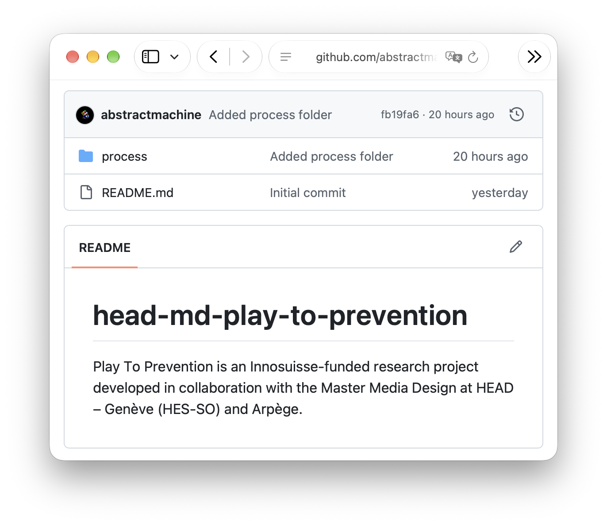

# Tutorial
Here is a short résumé of the steps we took to set up a Markdown-based documentation process. The idea is to sync the same folder between [Github](https://github.com) online and locally inside of [VS Code](https://code.visualstudio.com).

## Install
Make sure you have installed, or have access to, the following tools:
- [VS Code](https://code.visualstudio.com/download)
- Terminal (macOS/Linux) / Powershell (Windows)
- [Git](https://git-scm.com/install/)
- [Homebrew](https://brew.sh) (macOS) / ???? (Windows) / `apt-get` (Linux)

Git should be installed on macOS by default. On Windows you will need to follow the link above.

## Git
[Git](https://git-scm.com) is a folder-and-contents syncing and backup tool created by [Linus Torvalds](https://en.wikipedia.org/wiki/Linus_Torvalds) to help him and the open-source community to develop the Linux operating system.

In its most basic form, a `git` repository is nothing more than a *folder* containing *other folders* and *files*. It's as simple as that. Yes — *take a deep breath* — it is as simple as that.

Git can be used entirely locally to create backups of your work. In `git`-speak these backups are time-coded and are called "commits". One of the main advantages of [Git](https://git-scm.com) is being able to return to any of your previous commits by simply rewinding the clock back in time to the state of your repository before you #@$% it up at 3AM on a bender.

While local backups are handy, most people use [Git](https://git-scm.com) to backup their work online in private online repositories, or share inside of a group or publicly via online websites.

There are many `git` repository websites for sharing `git` folders. The two most famous are:

- [Github](https://github.com)
- [HuggingFace](https://huggingface.co)

## Github
Start by creating an account on [Github](https://github.com).

Students should either use their `hesge.ch` email to create their new account, or add this student account as their second email to their already existing github account. This student email will be necessary later in this semester project, when we start working with Copilot: [Access GitHub Copilot for free as a student](https://docs.github.com/en/copilot/how-tos/copilot-on-github/set-up-copilot/enable-copilot/set-up-for-students). Please do this sooner rather than later.

## New Repository
Let's create our semester project!

Sign-in to your Github account and create a [new repository](https://github.com/new):



When you create a "new repository" on github, all you are doing is creating a folder in the cloud. After we have done this, we will sync this folder locally so that we can work on it directly from our machine.

## Readme
The most common type of file inside any git project is a special type of text file called `readme.md`. Whenever you navigate to any project folder on github, the website will automatically show you any `readme.md` file in that folder. When you are reading documentation on Github, you are almost always reading a `readme.md` inside of whatever project folder you are looking at.

This file is so important that Github proposes a default `readme.md` file to get you started.



## Repository Link

Each student will use the name `head-md-play-to-prevention`. Note how github automatically has created a link inside of my github space [github.com/abstractmachine](https://github.com/abstractmachine) and added my new repository to it. The full project link will therefore be [https://github.com/abstractmachine/head-md-play-to-prevention/](). This is full link is what you will share with whoever needs to access the project.



## Sync
Once you have created your project in the cloud, let's sync it to our local machine so we can make changes to it. This will create a "cloned" copy of your online, cloud-based, folder on Github with a local copy on your machine. Whenever you make changes to your local folder, you will type some magical words into the computer and the two folders will sync up.

## Github Tool
Github claims to have a tool that will simplify this process. Since we are already using the `Terminal` this year in Media Design for other work, let's try the [Github CLI](https://cli.github.com) (Command Line Interface) that was designed to work in the Terminal. This command line interface adds a new command named `gd` to your Terminal.

If you are on a macOS machine, and you have [Homebrew](https://brew.sh) installed, type in these commands:


On Windows, follow the instructions from the [Github CLI](https://cli.github.com) page.

If you need to authenticate with the GitHub website, use this command:

```
% gh auth login
```

This will open a webpage where you can sign-in and authenticate your local repository with GitHub.

## Parent Folder
When you pull a project from github onto your computer, you need to decide which "parent" folder will contain this repository. Remember that a "repository" is nothing more than a folder — so you need to place that folder somewhere. Choose a folder that will be this parent folder and open it in your terminal.

On macOS, Windows, and Linux, you can then tell your terminal to move to this folder so that you can work inside of it from the terminal. Open your terminal app, type `cd` (Change Directory) and drag your parent folder into the Terminal.



## Clone
Once you have installed the `gh` command onto your computer, you can then return to the `Github` repository page you created, copy the clone command. Select the green `Code` button > `GitHub CLI` > copy.



You can then copy this command directly into your Terminal and press enter. Once the "clone" of your folder has completed, go into that cloned directory in your Terminal.

```
% cd head-md-play-to-prevention
% open .
```

You should now see the contents of your Github online repository folder "cloned" onto your local machine.

## Make Changes
Let's make some changes to our local `readme.md` file and "push" them back up to the GitHub cloud.



## Commit
We need to note the changes that we made. From your Terminal, type:

```
% git add .
```

This will mark all (`.`) the files that changed in this folder as ready-to-be-synced.

Then explain what you did with a short phrase:

```
% git commit -m "Documented project origins"
```

And now we can "push" our changed back up to the cloud:

```
% git push
```

If all went well, we should now be able to see our changes on our GitHub page on the Web:

